# Maize Leaf Disease Classification using Vision Transformers


## Table of Contents
1. [About The Project](#about-the-project)
2. [Features](#features)
3. [Mobile Application](#mobile-application)
4. [Project Structure](#project-structure)
5. [The Dataset](#the-dataset)
6. [Model Architecture & Training](#model-architecture--training)
7. [Hyperparameter Tuning: Grid Search](#hyperparameter-tuning-grid-search)
   - [Grid Search Configuration](#grid-search-configuration)
   - [Grid Search Results Summary](#grid-search-results-summary)
8. [Best Model Performance](#best-model-performance)
   - [Optimal Hyperparameters](#optimal-hyperparameters)
   - [Final Test Metrics](#final-test-metrics)
   - [Confusion Matrix (Test Set)](#confusion-matrix-test-set)
9. [System Testing & Validation](#system-testing--validation)
10. [Getting Started](#getting-started)
    - [Prerequisites](#prerequisites)
    - [Installation](#installation)
11. [Usage](#usage)
    - [Running the GUI Application](#running-the-gui-application)
    - [Running the API Server](#running-the-api-server)
    - [Model Training & Grid Search](#model-training--grid-search)
    - [Evaluating the Best Model](#evaluating-the-best-model)
    - [Running Tests](#running-tests)
12. [License](#license)

## 1. About The Project

This project explores a modern approach to classifying maize (corn) leaf diseases by applying a **Vision Transformer (ViT)** architecture. Shifting from the conventional use of Convolutional Neural Networks (CNNs) for this task, this work investigates the effectiveness of the Transformer-based paradigm in computer vision for agricultural applications.

The methodology is centered around **transfer learning**, where a `google/vit-base-patch16-224` model, pre-trained on the vast ImageNet dataset, is fine-tuned to accurately identify five common diseases and healthy maize leaves.

To demonstrate the practical viability of this approach, this **prototype** is implemented as a complete framework that includes:
- A robust training and evaluation pipeline.
- Systematic hyperparameter tuning using Grid Search.
- Dual inference endpoints: a user-friendly desktop GUI and a scalable Flask API.
- A comprehensive testing suite to ensure reliability and stability.

Ultimately, this entire backend system is designed to serve as the intelligent core for a mobile application, enabling real-time, on-the-field disease diagnosis.

## 2. Features

- **State-of-the-Art Architecture**: Leverages a **Vision Transformer (ViT)**, providing a modern alternative to traditional CNNs for image classification tasks.

- **Transfer Learning**: Built upon a pre-trained `google/vit-base-patch16-224` model, significantly reducing training time and improving performance by utilizing features learned from the ImageNet dataset.

- **Hyperparameter Optimization**: Includes a complete **Grid Search** pipeline to systematically discover the most effective combination of hyperparameters for the model.

- **Advanced Training Techniques**:
  - **Gradual Unfreezing**: Intelligently unfreezes model layers during training to fine-tune effectively.
  - **Mixup Augmentation**: Creates rich, synthetic training examples to enhance model generalization.
  - **Class Weighting**: Addresses data imbalance by applying custom weights to the loss function, ensuring minority classes are not ignored.
  - **Learning Rate Scheduling & Early Stopping**: Optimizes the learning process and prevents overfitting.

- **Multiple Deployment Options**:
  - **Desktop GUI**: A user-friendly application built with `CustomTkinter` for easy local inference.
  - **REST API**: A scalable backend server using **Flask**, ready to serve predictions to any client.
  - **Mobile-Ready**: The API is specifically designed to be consumed by a companion mobile application for on-the-field use.

- **Comprehensive Testing Suite**: A robust set of unit, integration, and network tests ensures the reliability and stability of every component, from the model to the API.

- **Configuration-Driven**: The entire project is managed through a central `config.yaml` file, making it simple to adjust parameters and run new experiments.

## 3. Mobile Application

To translate this powerful model into a practical, real-world tool, a companion mobile application has been developed. This app allows users to leverage the complex Vision Transformer model directly from their smartphones, providing an accessible solution for on-the-field disease diagnosis.

### API-Driven Workflow

The mobile application is a client that communicates with the **Flask API server** (`gui/server.py`) from this repository. The interaction is designed to be simple and efficient:

1.  **Image Capture**: The user captures an image of a maize leaf using the mobile app's camera.
2.  **API Request**: The app sends the captured image via an HTTP `POST` request to the `/predict` endpoint of the running backend server.
3.  **Backend Processing**: The Flask server receives the image, processes it, and performs inference using the fine-tuned ViT model.
4.  **JSON Response**: The server returns the prediction results—specifically the disease class and confidence score—in a structured `JSON` format.
5.  **Display Results**: The mobile app parses the JSON response and displays the diagnosis to the user in a clear, easy-to-understand interface.

### Visual Showcase

Here is a glimpse of the mobile application's user interface.

| | | |
|:----------------------------------------------------------:|:----------------------------------------------------------:|:----------------------------------------------------------:|
|  | 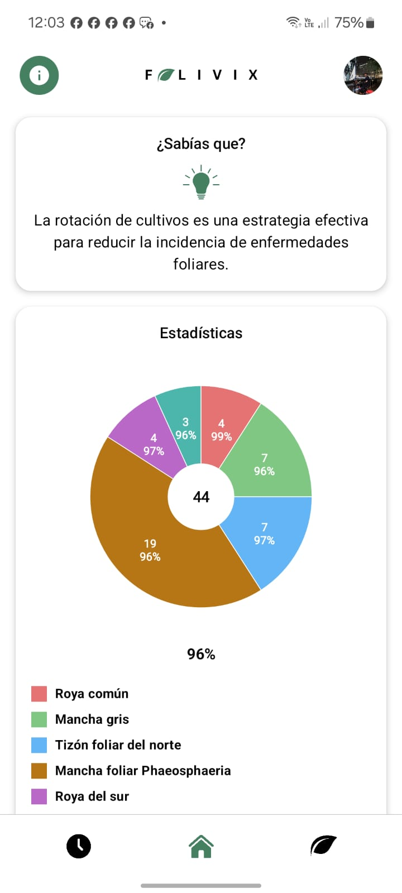 | 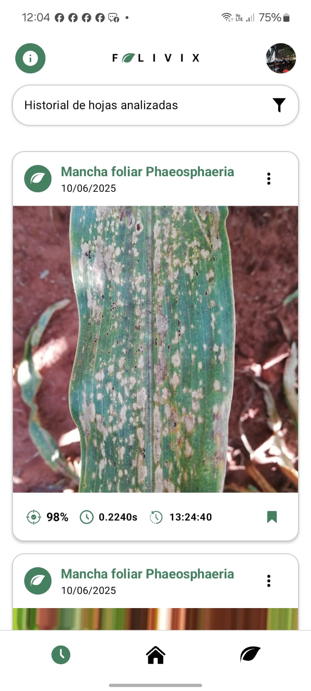 |
| 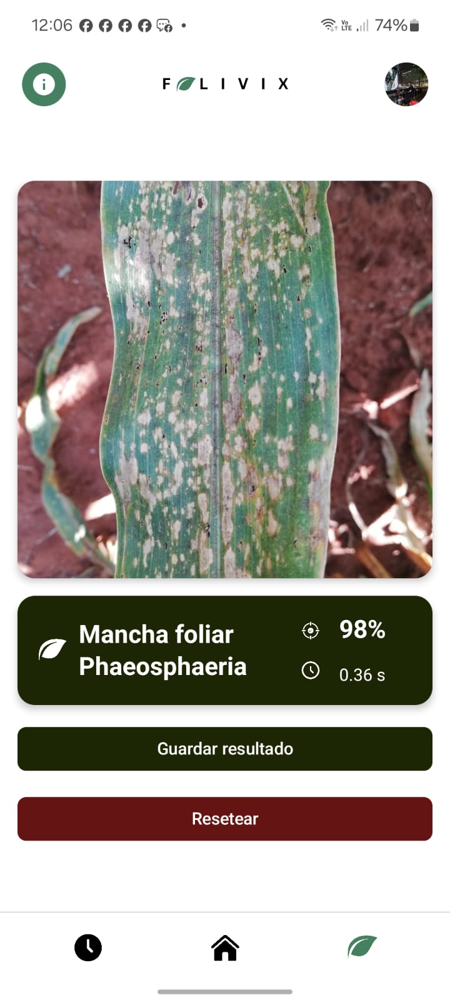 |  | 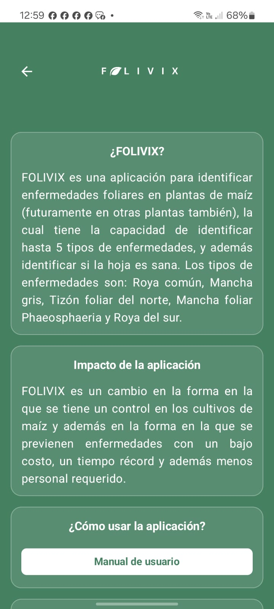 |

### Get the App

The source code and installation instructions for the mobile application are available in a separate repository.
- **Mobile App Repository**: [App](https://github.com/AlvaroVasquezAI/FOLIVIX)

## 4. Project Structure

The repository is organized to promote modularity and maintainability, with a clear separation of concerns.

```text
root/
├── config/                      
│   └── config.yaml  
├── data/                      
│   ├── test/
│   │   ├── Common_Rust/
│   │   ├── Gray_Leaf_Spot/
│   │   ├── Healthy/
│   │   ├── Northern_Leaf_Blight/
│   │   ├── Phaeosphaeria_Leaf_Spot/
│   │   ├── Southern_Rust/
│   │   └── test.csv
│   ├── train/
│   │   ├── Common_Rust/
│   │   ├── Gray_Leaf_Spot/
│   │   ├── Healthy/
│   │   ├── Northern_Leaf_Blight/
│   │   ├── Phaeosphaeria_Leaf_Spot/
│   │   ├── Southern_Rust/
│   │   └── train.csv
│   ├── validation/
│   │   ├── Common_Rust/
│   │   ├── Gray_Leaf_Spot/
│   │   ├── Healthy/
│   │   ├── Northern_Leaf_Blight/
│   │   ├── Phaeosphaeria_Leaf_Spot/
│   │   ├── Southern_Rust/
│   │   └── validation.csv
│   └── description.txt
├── gui/                  
│   ├── __init__.py
│   ├── app.py
│   └── server.py
├── models/                   
│   ├── checkpoints/          
│   │   └── best_model.pth
│   └── grid_search/            
│         ├── best_model/
│         │       └── best_model_date.pth
│         └── results/date/
│                ├── best_params.json
│                ├── grid_search_results.csv
│                └── ... (metrics files)
├── src/         
│   ├── data/          
│   │   └── dataset.py
│   ├── eval/                  
│   │   ├── evaluate_best_model.py 
│   │   └── results/         
│   │        ├── ... (report & matrix files)
│   ├── grid_search/          
│   │   ├── grid_search.py
│   │   └── run_grid_search.py
│   ├── models/          
│   │   └── vit_model.py
│   ├── training/          
│   │   └── trainer.py
│   └── utils/          
│       └── helpers.py
├── test_images/         
│   └── ... (sample images)
├── tests_results/         
│   ├── network/
│   └── ... (test result artifacts)
├── tests/         
│   ├── api/
│   ├── integration/
│   ├── model/
│   └── network/
├── .gitattributes
├── .gitignore
├── LICENSE
├── main.py         
├── README.md       
└── requirements.txt
```
## 5. The Dataset

This project utilizes the **Maize Leaf Disease** dataset, a collection of images specifically gathered for agricultural computer vision tasks. The data is pre-organized into three distinct splits—`train`, `validation`, and `test`—to ensure proper model training, tuning, and unbiased evaluation.

### Dataset Classes
The model is trained to classify maize leaves into one of six categories:

1.  **Common Rust**
2.  **Gray Leaf Spot**
3.  **Healthy**
4.  **Northern Leaf Blight**
5.  **Phaeosphaeria Leaf Spot**
6.  **Southern Rust**

### Sample Images

Below is a representative sample image from the training set for each class, providing a visual overview of the data.

| Common Rust | Gray Leaf Spot | Healthy |
| :----------------------------------------------------------: | :-------------------------------------------------------------: | :---------------------------------------------------: |
| 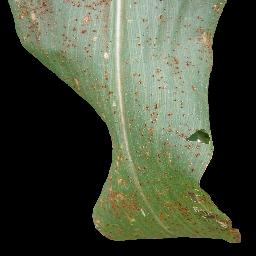 | 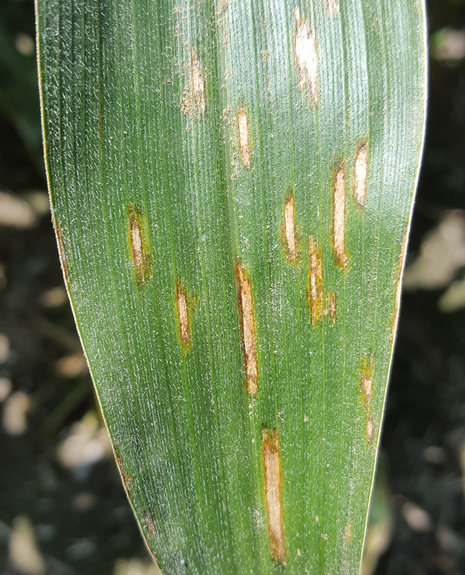 |  |
| **Northern Leaf Blight** | **Phaeosphaeria Leaf Spot** | **Southern Rust** |
| 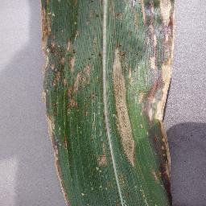 | 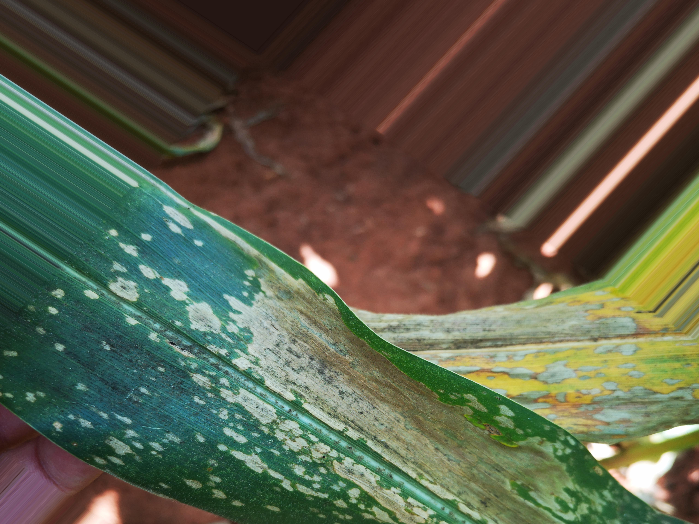 | 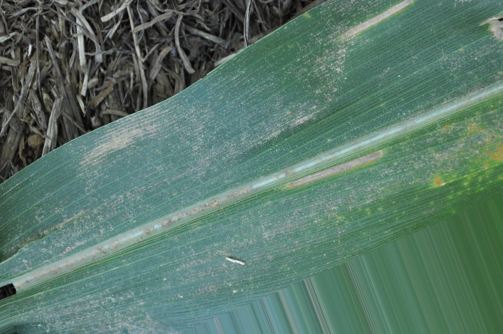 |

### Data Augmentation

To build a robust model that generalizes well to new, unseen images, a series of data augmentations are applied to the training set in real-time. This process, defined in `src/data/dataset.py`, creates modified versions of the training images for each epoch, helping to prevent overfitting. The techniques used include:

-   **Geometric Transformations**:
    -   Random Horizontal & Vertical Flips
    -   Random Rotations (up to 30 degrees)
    -   Random Affine transformations (scaling and translation)
    -   Random Perspective changes
-   **Color Space Adjustments**:
    -   Random Color Jitter (adjusting brightness, contrast, saturation, and hue)

## 6. Model Architecture & Training

### Vision Transformer (ViT) Architecture
This project moves beyond traditional Convolutional Neural Networks (CNNs) and leverages a **Vision Transformer (ViT)**, specifically the `google/vit-base-patch16-224` model. The ViT architecture processes images by:
1.  **Patching**: Splitting the input image (224x224 pixels) into a sequence of smaller, fixed-size patches (16x16 pixels).
2.  **Embedding**: Linearly embedding each patch into a vector and adding positional information.
3.  **Transformer Encoder**: Feeding this sequence of vectors into a standard Transformer encoder, the same architecture that powers state-of-the-art models in Natural Language Processing.

This approach allows the model to learn global relationships between different parts of an image, making it highly effective for complex visual recognition tasks.

### Transfer Learning Strategy
To achieve high accuracy without requiring an enormous dataset or extensive training time, this project employs **transfer learning**. The model is initialized with weights pre-trained on the massive ImageNet dataset. These weights contain rich, general-purpose visual features that are then **fine-tuned** on our specific maize leaf disease dataset.

### Training Pipeline
The training process, orchestrated by the `Trainer` class in `src/training/trainer.py`, incorporates several key techniques to ensure a robust and well-generalized final model:

-   **Gradual Unfreezing**: A sophisticated fine-tuning strategy where initially only the final classification layer is trained. As training progresses, more layers of the ViT backbone are sequentially unfrozen. This allows the model to first adapt its decision-making process and then gradually adjust its deeper feature extraction capabilities to the specific nuances of maize leaf diseases.

-   **Class Weighting**: The dataset exhibits some class imbalance. To counteract this, a **weighted Cross-Entropy Loss** function is used. Classes with fewer samples (such as `Southern Rust` and `Phaeosphaeria Leaf Spot`) are assigned higher weights, forcing the model to pay more attention to them during training and preventing it from becoming biased towards the majority classes.

-   **Mixup Augmentation**: A powerful data augmentation technique that creates synthetic training examples by linearly interpolating pairs of images and their labels. This helps to regularize the model, improve its generalization, and make it less sensitive to adversarial examples.

-   **AdamW Optimizer**: An improved version of the Adam optimizer that decouples weight decay from the gradient update, often leading to better model performance.

-   **ReduceLROnPlateau Scheduler & Early Stopping**: The learning rate is automatically reduced when the validation loss plateaus, allowing the model to make finer adjustments as it converges. To prevent overfitting and save resources, training is automatically halted if the validation loss fails to improve for a specified number of epochs.

## 7. Hyperparameter Tuning: Grid Search

To ensure the model performs optimally, a systematic hyperparameter search was conducted using a **Grid Search** methodology. This process, implemented in `src/grid_search/grid_search.py`, involves training and evaluating the model across a defined parameter space to identify the most effective configuration.

### Grid Search Configuration

The search was conducted over the parameter space detailed below. Key hyperparameters such as `learning_rate`, `weight_decay`, and `batch_size` were varied, while others were held constant to ensure a controlled experiment.

| Parameter                 | Values / Searched Space | Description                                                    |
| :------------------------- | :---------------------- | :------------------------------------------------------------- |
| `learning_rate`            | `[1e-5, 5e-5]`          | Controls the step size during optimization.                    |
| `weight_decay`             | `[0.01, 0.02]`          | Regularization technique to prevent overfitting.               |
| `batch_size`               | `[16, 32]`              | Number of samples processed before the model is updated.       |
| `num_epochs`               | 15                      | Total number of passes through the entire training dataset.    |
| `scheduler_patience`       | 3                       | Epochs with no improvement to wait before reducing LR.         |
| `scheduler_factor`         | 0.1                     | Factor by which the learning rate is reduced.                  |
| `hidden_dropout_prob`      | 0.1                     | Dropout probability for the fully connected layers.            |
| `attention_probs_dropout` | 0.1                     | Dropout probability for the attention mechanisms.              |

Varying the `learning_rate`, `weight_decay`, and `batch_size` resulted in a total of **8 unique hyperparameter combinations** (2 × 2 × 2) being trained and evaluated. The model with the highest **validation accuracy** was selected as the best performer.

### Grid Search Results Summary

The table below provides a comprehensive summary of the results for each run. The model selection was based purely on the validation accuracy (`Val Acc`).

| LR   | WD   | BS | Train Acc | Train Loss | Val Acc | Val Loss | Test Acc | Test Loss |
| :--- | :--- | :- | :-------- | :--------- | :------ | :------- | :------- | :-------- |
| 1e-5 | 0.01 | 16 | 0.9724    | 0.1026     | 0.8314  | 0.7527   | 0.9291   | 0.3539    |
| 1e-5 | 0.01 | 32 | 0.9757    | 0.0921     | 0.8416  | 0.6905   | 0.9321   | 0.3326    |
| 1e-5 | 0.02 | 16 | 0.9778    | 0.0904     | 0.8460  | 0.6991   | 0.9291   | 0.3317    |
| 1e-5 | 0.02 | 32 | 0.9739    | 0.0953     | 0.8592  | 0.6229   | 0.9409   | 0.3217    |
| 5e-5 | 0.01 | 16 | 0.9866    | 0.0572     | 0.8519  | 0.8494   | 0.9365   | 0.3683    |
| **5e-5** | **0.01** | **32** | **0.9836**    | **0.0637**     | **0.8680**  | **0.8207**   | **0.9498**   | **0.3503**    |
| 5e-5 | 0.02 | 16 | 0.9847    | 0.0624     | 0.8446  | 0.7792   | 0.9527   | 0.3405    |
| 5e-5 | 0.02 | 32 | 0.9829    | 0.0651     | 0.8622  | 0.6999   | 0.9527   | 0.3064    |

The search identified the combination of `learning_rate=5e-5`, `weight_decay=0.01`, and `batch_size=32` as the optimal configuration, achieving the highest validation accuracy of **86.80%**. This configuration was selected for the final model.

## 8. Best Model Performance

Following the Grid Search, the model configuration that yielded the highest validation accuracy was selected as the final, best-performing model. This model, saved in `models/grid_search/best_model/`, represents the most effective combination of hyperparameters found during the search.

### Optimal Hyperparameters

The optimal hyperparameters identified by the Grid Search are as follows:

```json
{
    "learning_rate": 5e-05,
    "weight_decay": 0.01,
    "batch_size": 32,
    "num_epochs": 15,
    "scheduler_patience": 3,
    "scheduler_factor": 0.1,
    "hidden_dropout_prob": 0.1,
    "attention_probs_dropout_prob": 0.1
}
```

### Final Test Metrics

This optimized model was then evaluated on the completely unseen **test set** to provide an unbiased measure of its real-world performance.

-   **Overall Test Accuracy**: **94.98%**

The table below shows the detailed classification report, including precision, recall, and F1-score for each class.

| Class                     | Precision | Recall | F1-Score | Support |
| :------------------------ | :-------: | :----: | :------: | :-----: |
| Common Rust               |  1.0000   | 0.9916 |  0.9958  |   119   |
| Gray Leaf Spot            |  0.9558   | 0.9908 |  0.9730  |   109   |
| Healthy                   |  1.0000   | 0.9310 |  0.9643  |   116   |
| Northern Leaf Blight      |  0.9894   | 0.9490 |  0.9688  |   98    |
| Phaeosphaeria Leaf Spot   |  0.8516   | 0.9635 |  0.9041  |   137   |
| Southern Rust             |  0.9438   | 0.8571 |  0.8984  |   98    |
|                           |           |        |          |         |
| **Accuracy**              |           |        | **0.9498** | **677** |
| **Macro Avg**             |  0.9568   | 0.9472 |  0.9507  |   677   |
| **Weighted Avg**          |  0.9532   | 0.9498 |  0.9502  |   677   |

### Confusion Matrix (Test Set)
The confusion matrix below provides a visual breakdown of the model's predictions versus the actual labels on the test set. The diagonal elements represent correctly classified samples.

<p align="center">
  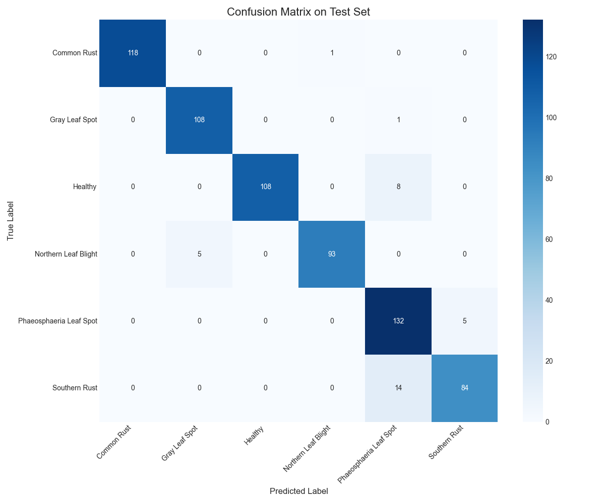
</p>

This detailed analysis confirms the model's strong performance and its ability to distinguish between the different maize leaf diseases with high accuracy.

## 9. System Testing & Validation

To ensure the reliability, stability, and correctness of the entire solution, this project includes a comprehensive and multi-layered testing suite located in the `tests/` directory. The tests are designed to validate every component, from the core model logic to the API's behavior under stress.

The test results, including detailed performance plots and JSON logs, are automatically generated and saved in the `tests_results/` directory.

### Testing Strategy

-   **Unit Tests (`tests/model/`)**: These tests focus on the smallest components of the machine learning pipeline in isolation, verifying correct model loading, image processing, and inference output formats.

-   **API Tests (`tests/api/`)**: These tests validate the Flask API server, ensuring it handles requests correctly, manages errors gracefully, and processes various image formats.

-   **Integration & Performance Tests (`tests/integration/`)**: These tests evaluate the system as a whole. They include a full-flow test to identify bottlenecks, a load test to measure scalability (RPS), and a stability test to detect performance degradation over time.

-   **Network Tests (`tests/network/`)**: These tests simulate adverse network conditions to verify the system's resilience against timeouts and connection losses.

### Key Performance Visualizations

The integration and performance tests generate several key visualizations, providing insights into the system's behavior. Below are some of the most important results from the test runs.

| Response Time Distribution | Processing Time by Phase |
| :----------------------------------------------------------: | :----------------------------------------------------------: |
| 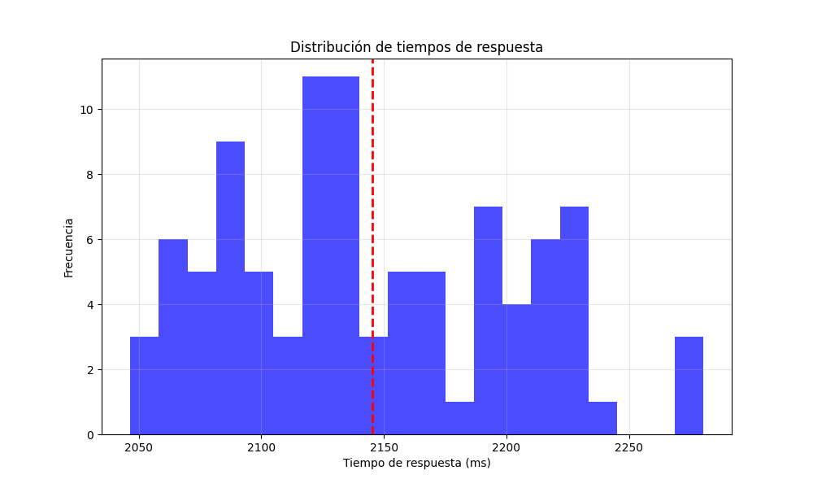 | 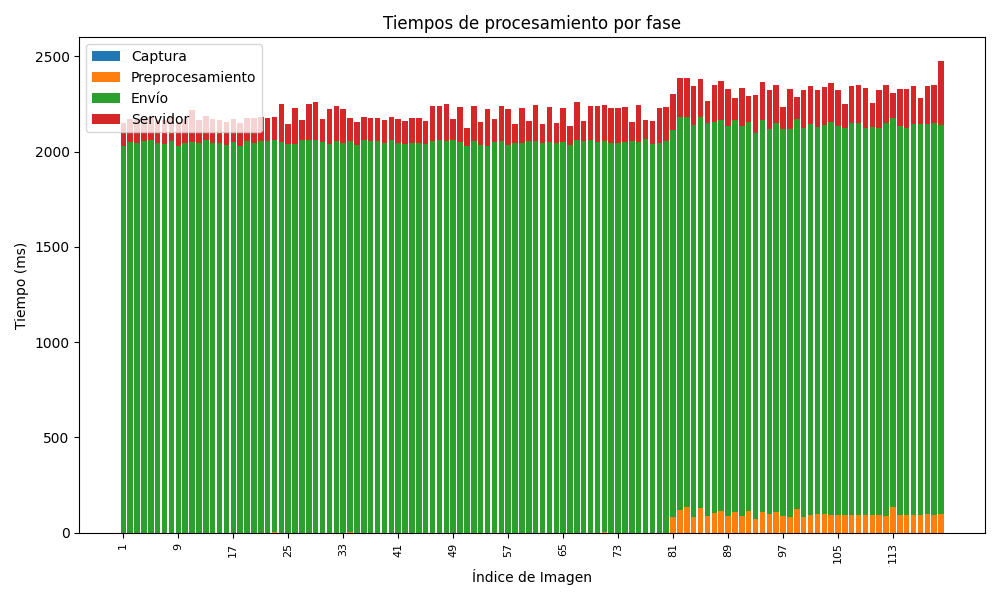 |
| **Server Processing Time Distribution** | **Total Time vs. Image Size** |
| 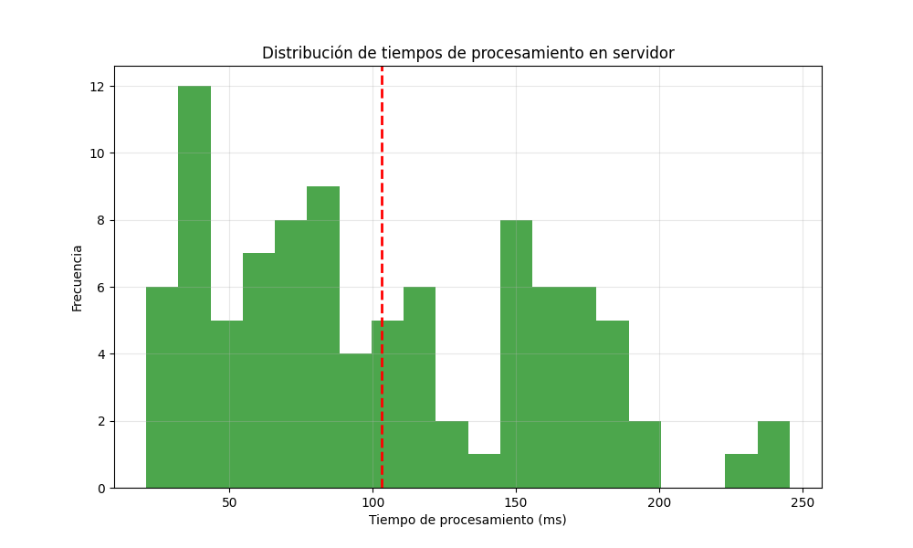 | 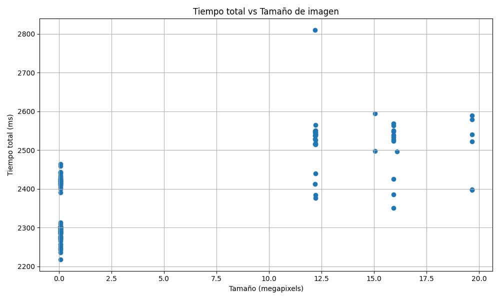 |

This rigorous testing approach ensures that the project is not only accurate but also robust and production-ready.

## 10. Getting Started

Follow these instructions to set up the project environment and install all necessary dependencies to run the application on your local machine.

### Prerequisites

Before you begin, ensure you have the following software installed on your system:

-   **Python**: Version 3.8 or higher. You can download it from [python.org](https://www.python.org/downloads/).
-   **Git**: Required for cloning the repository. You can download it from [git-scm.com](https://git-scm.com/downloads).
-   **Virtual Environment Manager** (Highly Recommended): Using a tool like `venv` (included with Python) or `conda` is strongly advised to isolate project dependencies.

### Installation

1.  **Clone the Repository**
    Open your terminal or command prompt and run the following command to clone the project:
    ```sh
    git clone https://github.com/AlvaroVasquezAI/Maize_Leaf_Disease_Classification.git
    cd Maize_Leaf_Disease_Classification
    ```

2.  **Create and Activate a Virtual Environment**
    It is best practice to create a virtual environment to avoid conflicts with other Python projects.
    
    ```sh
    # Create the virtual environment
    python -m venv venv

    # Activate the environment
    # On Windows:
    venv\Scripts\activate
    # On macOS/Linux:
    source venv/bin/activate
    ```
    You will know the environment is active when you see `(venv)` at the beginning of your terminal prompt.

3.  **Install Dependencies**
    The `requirements.txt` file contains all the necessary libraries pinned to specific versions for guaranteed compatibility. Install them with a single command:
    ```sh
    pip install -r requirements.txt
    ```
    This will install PyTorch, Transformers, Flask, and all other required packages. Once this process is complete, the project is ready to be used.

## 11. Usage

This project offers several ways to interact with the model, from running inference to training and testing. All commands should be executed from the **root directory** of the project.

### Running the GUI Application

For easy, local predictions, you can launch the desktop application. This provides a user-friendly interface to classify your own images.

1.  **Run the application:**
    ```sh
    python -m gui.app
    ```
2.  **Use the GUI:**
    -   Click "Select Model" and navigate to `models/grid_search/best_model/` to load the `.pth` file.
    -   Once the model is loaded, click "Select Image" to choose a maize leaf image from your computer.
    -   The predicted class and confidence score will appear automatically.

### Running the API Server

To serve the model via a REST API (required for the mobile app or other clients), run the Flask server.

1.  **Start the server:**
    ```sh

    python -m gui.server
    ```
    The server will start and listen for requests on `http://localhost:5000`.

2.  **Send a prediction request:**
    You can use tools like `curl` or Postman to send a `POST` request with an image file to the `/predict` endpoint.

    **Example using `curl`:**
    ```sh
    curl -X POST -F "image=@/path/to/your/leaf_image.jpg" http://localhost:5000/predict
    ```

### Model Training & Grid Search

The `main.py` script is the entry point for training the model or running the hyperparameter search.

1.  **Run a Standard Training Session:**
    This will train the model using the parameters defined in `config/config.yaml`.
    ```sh
    python main.py --mode train
    ```

2.  **Run the Grid Search:**
    This will execute the hyperparameter search defined in `src/grid_search/run_grid_search.py` to find the best model configuration.
    ```sh
    python main.py --mode grid_search
    ```
    or
    ```sh
    python -m src.grid_search.run_grid_search
    ```

### Evaluating the Best Model

After training, you can generate a detailed performance analysis (classification report and confusion matrix) of the best model using the dedicated evaluation script.

1.  **Evaluate on the Test Set (Default):**
    ```sh
    python -m src.eval.evaluate_best_model --split test
    ```

2.  **Evaluate on the Validation Set:**
    ```sh
    python -m src.eval.evaluate_best_model --split validation
    ```
    The output artifacts will be saved in the `src/eval/results/` directory.

### Running Tests

To verify the integrity and stability of the entire project, run the complete test suite.

```sh
python -m unittest discover tests
```
This command will automatically discover and run all tests located in the `tests/` directory.

## 12. License

This project is distributed under the MIT License. See the `LICENSE` file for more information.

---
